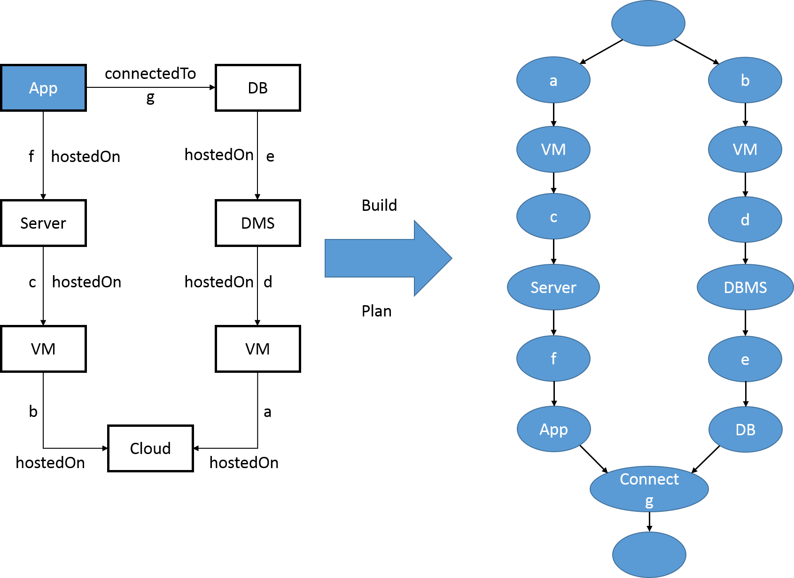
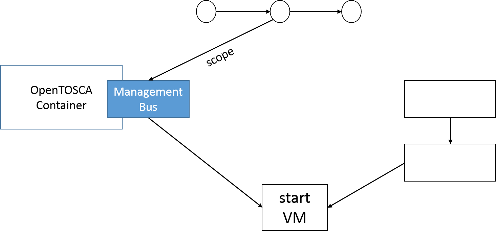

Documentation Plan Builder

The OpenTOSCA-Container uses the Tosca Runtime to generate build and termination plans, in BPEL format, out of given CSAR-Files.
These BPEL-plans run through given procedures to perform Activities.

The following documentation describes the build and termination plans and will give you an overview over the used Plug-Ins.

***Build Plan***

A BuildPlan describes the needed activities to create a service.
Therefor the plan contains single components and instances.
The instances define build sequences of components.
In the following example, the structure of a Cloud-Service, and his belonging BuildPlan, is shown in a tree structure.

The graphic shows a requested structure of the Cloud-Service.
Instances are represented by edges and components by nodes.
There are two different types of instances:

-   hostedOn: A component will be instantiated based on another existing component.
    In the given example a VM is required to start a server on top of it.

-   connectTo: A service can contain multiple, independent service components.
    By the time of their compilation, they need separate and parallelized procedures. 
	To realize the parallelization, a tree structure of a BuildPlan can contain multiple paths. 
    The single stacks of a service are synchronized and brought together by the connectTo-instance.
    In the given example, the connectTo-instance synchronizes two separate paths, the Application-Path and the Database-Path.

If a BuildPlan is given, a service can start automatically.

***Termination Plan***

A termination plan defines activities and their order of execution to shutdown the server.
The termination plan terminates the single components and instances opposed to the build plan.
Therefor the synchronization of the single paths must be terminated first.
Afterwards, the single components in the different paths can be terminated step by step.

As described above, the service components in the example are desynchronized via the connectTo instance.
The shutdown of the components and paths can be done subsequently.

***Basics***

In general, the advantage of build and termination plans is the possibility to execute complex processes automatically by single instructions.
In the end, the plans are available as a BPEL-file.

Every component require different activities, e.g. for start-up or shutdown.
Each Activity is described as a BPEL flow, where also the runtime scope of the activity is defined.
For example the scope to start a VM is the VM itself.
Every single instance and component defines their own activities with pre-/provisioning- and/or post-phase.
These phases are represented as sequences in the BPEL description.

The code-conversion is realized by a SkeletonCompletion based on a PlugIn (parametrization of the service).

**Skeleton Completion**
Skeleton Completion is part of the PlanBuilders' PluginSystem.
It prepares (completes) a given skeleton for the execution in the OpenTOSCA Runtime.
The structure of the PlugIn is build as follows:

The bool variables describes which templates can be used inside the PlugIn.
If the bool variable shows that the template cannot be handled, a ongoing treatment is impossible.
The use of a template is described in the handle method.

***Lifecycle-Plugin-System***

Besides the skeleton completion, the lifecycle-plugin-system can also process node templates.
The only limitation is the system only deals with node templates of following form as input:

The PlugIn accepts operations in a fixed sequence but permits predefined skips.
The node templates have to follow this sequence:
- install 
- configure 
- start

In this way, the corresponding code can be generated by entering a node typ and its methods.

According to the definition of the node types methods an appropriate function call is made afterwards.

The sequence described above proceeds in the provisioning phase of the lifecycle-system.
Operations can be webservices, code or typed objects.

The lifecycle system has 3 different plugin-types, which also contain different methods:
 
-   DeploymentArtifact-Plugin (DA)

    -   (public) canHandle(ArtifactType, Impl)
    -   (public) Handle(DeploymentArtifact)

-   ImplementationArtifact-Plugin (IA)

    -   (public) canHandle(ArtifactType): War-files are executed inside a TOSCARuntime in Tomcat.

-   Provisioning Plugin

    -   (public) canHandle(ArtifactType): The DA can be installed on an infrastructure node of the same type.
	
The plugins mentioned above pass different phases in their runtime:

1.  PrePhase

    The PrePhase executes DA as well as IA uploads.
    The plugin also handles DAs which are outlined as subplugins after the upload.

2.  ProvPhase

    The provisioning phase calls different operations.
    If the subplugin is able to understand and process these operations, they will be converted into code based on the artifact template.
    For specific types there are also different predefined configurations.

    After the execution of operations, the CSAR-files are replicated on the VM.
    Properties in the node type are set as variables in the main-BPEL-file.

3.  PostPhase

    After configuration, post phase starts during the runtime.
    Varibales, that have not yet been defined (ip's, api's, update properties ), are set at this point.

***Ubuntu-Plug-In***

TopologyContext Plan Completion

The cloud provider checks whether Ubuntu is active and then boots the VM within the Ubuntu scope.

***DockerContainer***

***ConnectsTo-Type-Plug-In***

Topology Context

PlanCompletion

The connectTo plugin handles the relations instead of the nodes.
This results in a synchronization of the individual services.

Simple Java code is converted directly into BPEL.
However, as soon as the Java code contains some simple if-else-clauses, automatic conversion is no longer possible.

***Invoker-Plug-In***

The invoker plugin constitutes a special lifecycle, which is invoked independently from previous plugins.